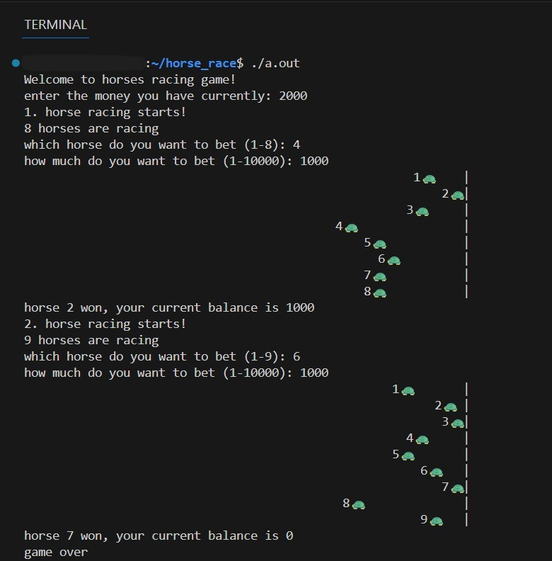

# Horse Race

The game simulates a race using random movement and allows the player to bet money on a horse.

---

# Horse Race on terminal


---

## Modules

### main.c
- Entry point of the program
- Handles user input
- Manages player balance and betting
- Starts races and checks results
- Ends the game when money is finished

---

### enes_util.c
- Utility module for the game
- Generates random numbers
- Simulates the horse race
- Draws the race animation in the terminal

---

### enes_util.h
- Header file for utility functions
- Declares shared functions and structures

---

## Data Structures

### struct horse
- Represents a horse in the race
- Stores the distance traveled on the track

---

## Function Summary

### get_random_number
- Returns a random number between given limits
- Uses system random source

### perform_race
- Runs the race simulation
- Moves horses forward randomly
- Displays race progress
- Returns the winning horse number

### print_spaces
- Prints spaces for alignment
- Used for drawing the race track

---

## Game Flow

1. Player enters starting money
2. Number of horses is randomly selected
3. Player chooses a horse and bet amount
4. Race is animated in the terminal
5. Winner is determined
6. Player balance is updated
7. Game repeats until balance is zero

---

## Platform

- Linux
- Windows (WSL)

---

## Build and Run

```bash
gcc main.c enes_util.c
./a.out
```
